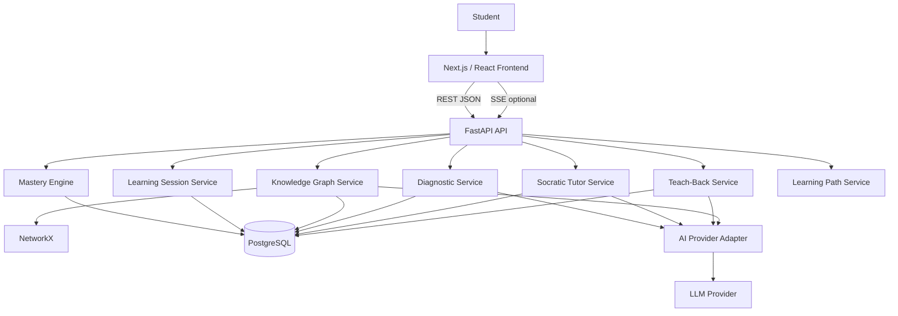
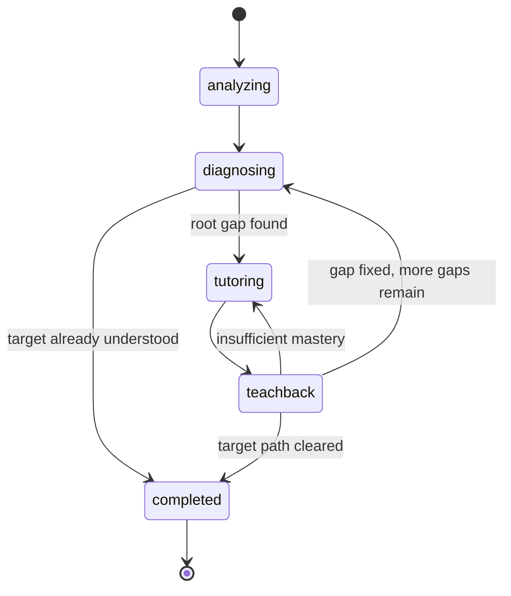

# RootLearn — Production Architecture & Master Build Prompt

> **Purpose:** This document is the implementation contract for building RootLearn with coding agents such as Codex, Kiro, Claude Code, or other AI software-engineering assistants.
>
> It is intentionally written as both a **system architecture specification** and a **master build prompt**. Follow it as the source of truth unless a later explicit product decision overrides it.

---

## 1. Product Definition

### 1.1 One-sentence definition

**RootLearn is an AI-powered knowledge debugger that finds the prerequisite concept causing a learner's confusion, teaches that missing concept through adaptive Socratic guidance, verifies understanding with teach-back, and updates a visual mastery graph.**

### 1.2 Core user problem

Most AI tutors answer the question a learner asks.

RootLearn instead asks:

> **Why is this learner unable to understand this concept yet?**

Example:

```text
Student: "I don't understand React useEffect."

RootLearn:
useEffect
  ↑
Side Effects
  ↑
Rendering   ← weak prerequisite detected
  ↑
State
  ↑
Components

Root gap: React Rendering
```

The system then teaches **React Rendering** before returning to `useEffect`.

### 1.3 Core learning loop

```text
Student confusion
    ↓
Target concept detection
    ↓
Prerequisite graph generation
    ↓
Adaptive diagnosis
    ↓
Root knowledge-gap detection
    ↓
Socratic tutoring
    ↓
Teach-back verification
    ↓
Mastery update
    ↓
Next learning step
```

This loop is the heart of the product. Features that do not strengthen this loop should not be prioritized in the initial build.

---

# 2. Architecture Appropriateness Review

Before implementation, use this section to understand why this architecture is intentionally smaller than a full learning-management platform.

## 2.1 What should be preserved

The architecture should preserve these ideas:

- prerequisite knowledge graphs;
- explainable learning-state calculations;
- separation between AI interpretation and deterministic state updates;
- structured AI outputs rather than free-form parsing;
- persistent learning history;
- adaptive questioning;
- traceable reasoning for why a concept was selected as the root gap;
- auditable AI runs;
- typed API contracts;
- clear service boundaries;
- tests for deterministic learning logic.

## 2.2 What should NOT be copied into RootLearn

Do **not** build these into the initial product unless explicitly requested later:

- instructor exam-management systems;
- CSV exam-score ingestion;
- class-wide analytics dashboards;
- student clustering;
- LMS exports;
- collaborative infinite canvas;
- multiplayer editing;
- presentation generation;
- podcast generation;
- video generation;
- generalized research workspaces;
- enterprise multi-tenant administration;
- large background-job infrastructure before a real need exists.

These systems add complexity without improving RootLearn's central diagnostic learning loop.

## 2.3 Critical design decision

AI should **not directly own mastery scores or root-gap state**.

Use AI for semantic tasks such as:

- concept decomposition;
- prerequisite suggestions;
- question generation;
- semantic evaluation of free-text answers;
- Socratic tutoring;
- teach-back rubric evaluation.

Use deterministic application code for:

- graph validation;
- mastery calculations;
- confidence calculations;
- root-gap ranking;
- state transitions;
- concept unlocking;
- learning-path ordering;
- persistence rules.

This separation makes the system more explainable, testable, and resistant to model inconsistency.

---

# 3. Product Scope

## 3.1 MVP scope

The first complete version must support exactly this flow:

1. User creates a learning session by describing what they do not understand.
2. AI identifies the target concept.
3. AI proposes a prerequisite graph.
4. Backend validates and stores the graph.
5. Diagnostic engine selects the next concept to test.
6. AI generates one targeted diagnostic question.
7. Student answers.
8. AI evaluates the answer against a rubric.
9. Deterministic mastery engine updates evidence and mastery.
10. Diagnostic engine repeats until confidence is sufficient.
11. Root-gap engine identifies the weakest high-impact prerequisite.
12. Socratic tutor teaches the root gap progressively.
13. Student performs a teach-back explanation.
14. AI evaluates the teach-back using structured criteria.
15. Mastery engine updates mastery.
16. Graph visually updates.
17. System recommends the next concept or returns to the original target.

## 3.2 Explicit non-goals for MVP

Do not implement in MVP:

- social features;
- classrooms;
- peer ranking;
- teacher dashboards;
- gamification economies;
- badges;
- payment systems;
- complex organization management;
- voice avatars;
- document-to-course generation;
- generic chatbot modes unrelated to diagnosis.

---

# 4. Recommended Technology Stack

## 4.1 Frontend

Preferred:

- Next.js 15+
- React
- TypeScript
- Tailwind CSS
- React Flow / `@xyflow/react`
- TanStack Query or equivalent server-state library
- Zod for runtime validation when useful

Alternative:

- Vite + React is acceptable if build speed matters more than full Next.js capabilities.

## 4.2 Backend

- Python 3.11+
- FastAPI
- Pydantic v2
- SQLAlchemy 2 async
- asyncpg
- Alembic
- NetworkX

## 4.3 Database

- PostgreSQL

## 4.4 AI provider

Implement a provider-neutral adapter.

Supported first provider can be one of:

- OpenAI
- Anthropic
- Google Gemini

Do **not** spread provider SDK calls throughout application services.

## 4.5 Optional infrastructure

Only add when justified:

- Redis for distributed cache/rate limiting/background jobs;
- object storage if user uploads are introduced;
- durable queue when asynchronous workloads become necessary.

For the hackathon/MVP, PostgreSQL + API process is sufficient.

---

# 5. High-Level System Architecture



---

# 6. Runtime Boundaries

## 6.1 Frontend responsibilities

Frontend owns:

- rendering;
- local interaction state;
- graph visualization;
- streaming token display if SSE is enabled;
- form validation;
- optimistic UI where safe;
- accessibility;
- presentation of explanations and mastery changes.

Frontend must **not** own:

- mastery rules;
- root-gap calculation;
- concept-unlocking rules;
- security decisions;
- AI provider credentials.

## 6.2 Backend responsibilities

Backend owns:

- session lifecycle;
- AI orchestration;
- graph validation;
- diagnostic state machine;
- mastery calculations;
- root-gap ranking;
- learning-path selection;
- persistence;
- authorization;
- AI output validation;
- model usage logging;
- API contract.

---

# 7. Core Domain Model

The key domain objects are:

1. User
2. LearningSession
3. Concept
4. ConceptEdge
5. DiagnosticQuestion
6. DiagnosticAttempt
7. TutorMessage
8. TeachBackAttempt
9. MasteryEvent
10. AIRun

Avoid introducing additional entities until a use case requires them.

---

# 8. Database Schema

## 8.1 `users`

```text
id                  UUID PK
email               VARCHAR UNIQUE NULLABLE for anonymous MVP
name                VARCHAR NULLABLE
created_at          TIMESTAMPTZ
updated_at          TIMESTAMPTZ
```

If authentication is deferred, create an anonymous user record per browser session rather than trusting arbitrary client-supplied user IDs.

---

## 8.2 `learning_sessions`

```text
id                  UUID PK
user_id             UUID FK users.id
original_prompt     TEXT
normalized_topic    VARCHAR
target_concept_id   UUID NULLABLE
status              ENUM
                    - analyzing
                    - diagnosing
                    - tutoring
                    - teachback
                    - completed
                    - abandoned
created_at          TIMESTAMPTZ
updated_at          TIMESTAMPTZ
completed_at        TIMESTAMPTZ NULLABLE
```

---

## 8.3 `concepts`

```text
id                  UUID PK
session_id          UUID FK learning_sessions.id
slug                VARCHAR
name                VARCHAR
description         TEXT
is_target           BOOLEAN
mastery_score       NUMERIC(5,4)
confidence_score    NUMERIC(5,4)
status              ENUM
                    - unknown
                    - weak
                    - learning
                    - understood
                    - mastered
                    - locked
created_at          TIMESTAMPTZ
updated_at          TIMESTAMPTZ
```

Constraints:

```text
0 <= mastery_score <= 1
0 <= confidence_score <= 1
unique(session_id, slug)
```

---

## 8.4 `concept_edges`

```text
id                  UUID PK
session_id          UUID FK
source_concept_id   UUID FK concepts.id
target_concept_id   UUID FK concepts.id
importance_weight   NUMERIC(5,4) DEFAULT 1.0
created_at          TIMESTAMPTZ
```

Meaning:

```text
source -> target
```

means:

```text
source is a prerequisite of target
```

Constraints:

- endpoints must belong to the same session;
- source != target;
- no duplicate edge;
- `0 <= importance_weight <= 1`;
- graph must remain acyclic.

---

## 8.5 `diagnostic_questions`

```text
id                  UUID PK
session_id          UUID FK
concept_id          UUID FK
question_text       TEXT
question_type       ENUM
                    - short_answer
                    - multiple_choice
                    - reasoning
                    - code
rubric_json         JSONB
difficulty          NUMERIC(5,4)
created_at          TIMESTAMPTZ
```

---

## 8.6 `diagnostic_attempts`

```text
id                  UUID PK
question_id         UUID FK
session_id          UUID FK
concept_id          UUID FK
student_answer      TEXT
correctness_score   NUMERIC(5,4)
reasoning_score     NUMERIC(5,4)
misconceptions_json JSONB
missing_points_json JSONB
ai_run_id           UUID FK ai_runs.id
created_at          TIMESTAMPTZ
```

---

## 8.7 `tutor_messages`

```text
id                  UUID PK
session_id          UUID FK
concept_id          UUID FK
role                ENUM(user, assistant, system)
content             TEXT
hint_level          INTEGER NULLABLE
ai_run_id           UUID NULLABLE
created_at          TIMESTAMPTZ
```

---

## 8.8 `teachback_attempts`

```text
id                  UUID PK
session_id          UUID FK
concept_id          UUID FK
student_explanation TEXT
coverage_score      NUMERIC(5,4)
reasoning_score     NUMERIC(5,4)
clarity_score       NUMERIC(5,4)
misconceptions_json JSONB
missing_points_json JSONB
ai_run_id           UUID FK
created_at          TIMESTAMPTZ
```

---

## 8.9 `mastery_events`

Never rely only on the current mastery number. Keep a history of why mastery changed.

```text
id                  UUID PK
session_id          UUID FK
concept_id          UUID FK
source_type         ENUM
                    - diagnostic
                    - tutoring
                    - teachback
                    - manual
old_score           NUMERIC(5,4)
new_score           NUMERIC(5,4)
old_confidence      NUMERIC(5,4)
new_confidence      NUMERIC(5,4)
reason_json         JSONB
created_at          TIMESTAMPTZ
```

---

## 8.10 `ai_runs`

```text
id                  UUID PK
session_id          UUID NULLABLE
purpose             VARCHAR
provider            VARCHAR
model               VARCHAR
prompt_version      VARCHAR
input_json          JSONB
output_json         JSONB
prompt_tokens       INTEGER NULLABLE
completion_tokens   INTEGER NULLABLE
latency_ms          INTEGER NULLABLE
success             BOOLEAN
error_code          VARCHAR NULLABLE
created_at          TIMESTAMPTZ
```

Never store provider API keys in this table.

---

# 9. Knowledge Graph Rules

The graph is a directed acyclic graph (DAG).

If:

```text
A -> B
```

then:

```text
A must generally be understood before B.
```

Examples:

```text
Functions -> Call Stack
Call Stack -> Recursion
Base Cases -> Recursion
```

## 9.1 Graph generation flow

1. Receive student topic.
2. Normalize topic.
3. Ask AI for a compact prerequisite graph.
4. Parse structured output.
5. Validate node count.
6. Validate unique IDs.
7. Validate edges.
8. Validate DAG.
9. Limit depth and breadth.
10. Persist only validated graph.

## 9.2 Graph size limits

For MVP:

```text
max nodes: 12
max depth: 5
max direct prerequisites per node: 4
```

The goal is diagnosis, not generating an entire textbook ontology.

## 9.3 Graph validation

Use NetworkX.

Reject graphs with:

- cycles;
- duplicate nodes;
- duplicate edges;
- missing endpoints;
- disconnected target concept when prerequisites exist;
- impossible weights;
- excessive size.

---

# 10. AI Provider Architecture

Create one interface:

```python
class AIProvider(Protocol):
    async def generate_structured(...): ...
    async def stream_text(...): ...
```

Example implementations:

```text
OpenAIProvider
AnthropicProvider
GeminiProvider
```

Application services depend on the interface, not the vendor SDK.

---

# 11. AI Task Boundaries

Implement AI tasks as explicit functions.

```python
analyze_target_concept()
generate_prerequisite_graph()
generate_diagnostic_question()
evaluate_diagnostic_answer()
generate_socratic_response()
evaluate_teachback()
```

Each task must:

1. have a versioned system prompt;
2. use structured schemas when possible;
3. validate output with Pydantic;
4. retry only on validation/transient failures;
5. have bounded retries;
6. log an `ai_runs` record;
7. fail safely.

---

# 12. Prompt Contracts

## 12.1 Target Concept Analyzer

### Goal

Identify the single primary concept the learner wants to understand.

### System prompt

```text
You are the concept-normalization component of RootLearn.

Your job is to identify the central concept a learner is struggling with.

Do not teach the concept.
Do not produce a lesson.
Do not invent unrelated prerequisites.

Return only valid structured output matching the schema.

Normalize informal phrasing into a concise concept name.
Preserve important domain context.

Example:
"I don't get why useEffect keeps rerunning" -> "React useEffect dependency behavior"
```

### Output schema

```json
{
  "name": "string",
  "slug": "string",
  "domain": "string",
  "short_description": "string"
}
```

---

## 12.2 Prerequisite Graph Generator

### Goal

Generate the smallest useful prerequisite DAG needed to diagnose the learner.

### System prompt

```text
You are RootLearn's prerequisite graph generator.

Your task is to identify the smallest set of prerequisite concepts needed to diagnose why a learner may not understand the target concept.

Do NOT generate a full curriculum.
Do NOT include loosely related concepts.
Do NOT create cycles.
Do NOT include more than 12 total nodes.

Each edge A -> B means A is a prerequisite for B.

Prefer foundational concepts that can realistically explain failure at the target concept.

Assign importance_weight from 0.0 to 1.0 based on how strongly understanding A affects understanding B.

Return only valid structured output.
```

### Output schema

```json
{
  "nodes": [
    {
      "slug": "functions",
      "name": "Functions",
      "description": "..."
    }
  ],
  "edges": [
    {
      "source": "functions",
      "target": "call-stack",
      "importance_weight": 0.9
    }
  ]
}
```

---

## 12.3 Diagnostic Question Generator

### Goal

Test one concept with one high-information question.

### System prompt

```text
You are RootLearn's diagnostic-question generator.

Generate ONE question that efficiently tests whether the learner understands the specified concept.

The purpose is diagnosis, not teaching.

Avoid trivia.
Avoid unnecessary wording.
Prefer questions that expose misconceptions.

The question must be answerable without hidden context.

Return a grading rubric containing the key ideas that a correct answer should demonstrate.
```

### Output schema

```json
{
  "question_text": "string",
  "question_type": "short_answer | multiple_choice | reasoning | code",
  "difficulty": 0.5,
  "rubric": {
    "required_points": ["..."],
    "common_misconceptions": ["..."]
  }
}
```

---

## 12.4 Diagnostic Answer Evaluator

### Goal

Semantically score a learner's answer against a stored rubric.

### System prompt

```text
You are RootLearn's diagnostic evaluator.

Evaluate the student's answer only against the supplied concept and rubric.

Do not reward verbosity.
Do not penalize grammar unless grammar changes technical meaning.
Do not teach in this response.
Do not infer knowledge that is not demonstrated.

Score:
- correctness
- reasoning quality

Identify:
- demonstrated points
- missing points
- misconceptions

Return structured output only.
```

### Output schema

```json
{
  "correctness_score": 0.0,
  "reasoning_score": 0.0,
  "demonstrated_points": [],
  "missing_points": [],
  "misconceptions": []
}
```

---

## 12.5 Socratic Tutor

### Goal

Help the student reason toward understanding without immediately giving the final explanation.

### System prompt

```text
You are RootLearn's Socratic tutor.

The learner is currently working on exactly one root-gap concept.

Your default strategy is:
1. ask a focused question;
2. if the learner struggles, provide a small hint;
3. then a stronger hint;
4. then an example;
5. explain directly only when necessary.

Do not overwhelm the learner.
Do not jump ahead to the target concept until the current prerequisite is understood.
Do not pretend the learner understands something they have not demonstrated.

Keep each response concise and interactive.
```

Tutor must receive:

- target concept;
- current root-gap concept;
- graph neighborhood;
- recent messages;
- known misconceptions;
- current mastery/confidence;
- hint level.

---

## 12.6 Teach-Back Evaluator

### Goal

Check whether the learner can explain the concept in their own words.

### System prompt

```text
You are RootLearn's teach-back evaluator.

The learner has attempted to explain a concept in their own words.

Evaluate conceptual understanding, not memorized wording.

Score:
- coverage
- reasoning
- clarity

Identify:
- concepts correctly explained
- missing ideas
- misconceptions

Do not produce a mastery score. RootLearn's deterministic mastery engine will calculate mastery separately.

Return structured output only.
```

### Output schema

```json
{
  "coverage_score": 0.0,
  "reasoning_score": 0.0,
  "clarity_score": 0.0,
  "demonstrated_points": [],
  "missing_points": [],
  "misconceptions": []
}
```

---

# 13. Diagnostic Engine

The diagnostic engine must behave as a state machine.

## 13.1 Objective

Find the most likely prerequisite gap using as few questions as reasonably possible.

Do not ask every possible prerequisite question.

## 13.2 Suggested strategy

Prioritize concepts by:

```text
information_priority =
    prerequisite_importance
    × uncertainty
    × downstream_impact
```

Where:

```text
uncertainty = 1 - confidence_score
```

Concepts with very high mastery and high confidence should not be repeatedly tested.

## 13.3 Stopping conditions

Stop diagnosis when one of these becomes true:

- root-gap confidence >= 0.80;
- maximum diagnostic questions reached;
- all relevant prerequisites have sufficient evidence;
- no meaningful root gap is found.

Recommended MVP maximum:

```text
6 diagnostic questions
```

---

# 14. Mastery Engine

## 14.1 Design principle

Mastery must be deterministic and explainable.

AI provides evidence scores. Application code converts evidence into mastery.

## 14.2 Evidence categories

For MVP:

```text
diagnostic evidence
practice/tutoring evidence
teach-back evidence
```

## 14.3 Suggested initial formula

When all evidence types exist:

```text
mastery =
    0.45 * diagnostic_score
  + 0.35 * practice_score
  + 0.20 * teachback_score
```

If evidence types are missing, renormalize weights across available evidence instead of treating missing values as zero.

Example:

If only diagnostic evidence exists:

```text
mastery = diagnostic_score
```

Do not falsely punish a concept simply because no teach-back has happened yet.

## 14.4 Confidence score

Suggested:

```text
confidence = min(
    evidence_quantity_factor,
    evidence_consistency_factor,
    evidence_recency_factor
)
```

MVP simplification:

```text
0 answers     -> 0.10
1 answer      -> 0.35
2 answers     -> 0.60
3 answers     -> 0.80
4+ answers    -> 0.90
```

Then reduce confidence when scores conflict strongly.

## 14.5 Mastery bands

```text
0.00 - 0.39  weak
0.40 - 0.69  learning
0.70 - 0.84  understood
0.85 - 1.00  mastered
```

A concept may be `locked` when one or more required prerequisites remain below the unlock threshold.

Suggested unlock threshold:

```text
0.70
```

---

# 15. Root-Gap Detection

Root gap should not be selected merely because it has the lowest mastery.

A weak concept only matters if it meaningfully blocks the target.

## 15.1 Suggested score

```text
gap_score =
    (1 - mastery_score)
    × confidence_score
    × path_importance
    × downstream_impact
```

Where:

- `path_importance` = cumulative edge importance from concept toward target;
- `downstream_impact` = number/weight of concepts blocked by this concept.

## 15.2 Example

```text
Functions
mastery: 0.90
confidence: 0.90
importance: 0.8

Call Stack
mastery: 0.31
confidence: 0.89
importance: 1.0

Base Case
mastery: 0.67
confidence: 0.72
importance: 0.8
```

Call Stack should rank as the root gap.

## 15.3 Explainability requirement

Every root-gap result must include a machine-generated explanation object.

Example:

```json
{
  "concept": "Call Stack",
  "mastery": 0.31,
  "confidence": 0.89,
  "gap_score": 0.61,
  "reasons": [
    "Low diagnostic performance",
    "Direct prerequisite of Recursion",
    "Two downstream concepts depend on it"
  ]
}
```

---

# 16. Learning Path Engine

Once the current gap is improved, choose the next step deterministically.

Rules:

1. prerequisites before dependents;
2. weak concepts before understood concepts;
3. prioritize concepts on the shortest relevant path to the target;
4. do not recommend unrelated branches;
5. avoid repeating mastered concepts unless new evidence lowers confidence.

Use topological ordering over the relevant subgraph.

---

# 17. Session State Machine



All transitions must occur server-side.

Do not let the frontend arbitrarily change session status.

---

# 18. Backend API

Base prefix:

```text
/api/v1
```

## 18.1 Sessions

### Create session

```http
POST /api/v1/sessions
```

Request:

```json
{
  "prompt": "I don't understand recursion"
}
```

Response:

```json
{
  "id": "uuid",
  "status": "analyzing"
}
```

---

### Get session

```http
GET /api/v1/sessions/{session_id}
```

---

### Delete session

```http
DELETE /api/v1/sessions/{session_id}
```

---

## 18.2 Graph

```http
POST /api/v1/sessions/{session_id}/graph/generate
GET  /api/v1/sessions/{session_id}/graph
```

`generate` should be idempotent unless `force=true` is explicitly supplied.

---

## 18.3 Diagnosis

```http
POST /api/v1/sessions/{session_id}/diagnosis/start
GET  /api/v1/sessions/{session_id}/diagnosis/current
POST /api/v1/sessions/{session_id}/diagnosis/answer
```

Answer request:

```json
{
  "question_id": "uuid",
  "answer": "..."
}
```

Answer response:

```json
{
  "evaluation": {
    "correctness": 0.6,
    "reasoning": 0.7
  },
  "mastery_change": {
    "before": 0.42,
    "after": 0.55
  },
  "diagnosis_complete": false,
  "next_question": {}
}
```

---

## 18.4 Root gap

```http
GET /api/v1/sessions/{session_id}/root-gap
```

---

## 18.5 Tutor

```http
POST /api/v1/sessions/{session_id}/tutor/messages
GET  /api/v1/sessions/{session_id}/tutor/messages
```

Optional streaming endpoint:

```http
POST /api/v1/sessions/{session_id}/tutor/stream
```

Use SSE, not WebSockets, unless bidirectional realtime transport becomes necessary.

---

## 18.6 Teach-back

```http
POST /api/v1/sessions/{session_id}/teachback
```

Request:

```json
{
  "concept_id": "uuid",
  "explanation": "..."
}
```

---

## 18.7 Mastery

```http
GET /api/v1/sessions/{session_id}/mastery
GET /api/v1/sessions/{session_id}/mastery/history
```

---

# 19. API Error Contract

Every API error should follow one format.

```json
{
  "error": {
    "code": "GRAPH_VALIDATION_FAILED",
    "message": "Generated prerequisite graph contains a cycle.",
    "request_id": "...",
    "details": {}
  }
}
```

Never expose:

- stack traces;
- provider API keys;
- raw database errors;
- internal prompts unless deliberately enabled in development.

---

# 20. Suggested Repository Structure

```text
rootlearn/
│
├── README.md
├── docker-compose.yml
├── .env.example
├── docs/
│   ├── architecture.md
│   ├── api.md
│   └── ai-prompts.md
│
├── backend/
│   ├── pyproject.toml
│   ├── alembic.ini
│   ├── alembic/
│   │
│   ├── app/
│   │   ├── main.py
│   │   ├── config.py
│   │   ├── database.py
│   │   ├── logging.py
│   │   │
│   │   ├── api/
│   │   │   ├── dependencies.py
│   │   │   └── routes/
│   │   │       ├── sessions.py
│   │   │       ├── graph.py
│   │   │       ├── diagnosis.py
│   │   │       ├── tutor.py
│   │   │       ├── teachback.py
│   │   │       └── mastery.py
│   │   │
│   │   ├── models/
│   │   │   ├── user.py
│   │   │   ├── learning_session.py
│   │   │   ├── concept.py
│   │   │   ├── diagnosis.py
│   │   │   ├── tutoring.py
│   │   │   ├── mastery.py
│   │   │   └── ai_run.py
│   │   │
│   │   ├── schemas/
│   │   │   ├── session.py
│   │   │   ├── graph.py
│   │   │   ├── diagnosis.py
│   │   │   ├── tutor.py
│   │   │   ├── teachback.py
│   │   │   └── mastery.py
│   │   │
│   │   ├── services/
│   │   │   ├── session_service.py
│   │   │   ├── graph_service.py
│   │   │   ├── diagnostic_service.py
│   │   │   ├── mastery_service.py
│   │   │   ├── root_gap_service.py
│   │   │   ├── tutor_service.py
│   │   │   ├── teachback_service.py
│   │   │   ├── learning_path_service.py
│   │   │   └── ai/
│   │   │       ├── base.py
│   │   │       ├── provider.py
│   │   │       ├── prompts.py
│   │   │       └── schemas.py
│   │   │
│   │   └── core/
│   │       ├── enums.py
│   │       ├── exceptions.py
│   │       └── security.py
│   │
│   └── tests/
│       ├── unit/
│       ├── integration/
│       └── fixtures/
│
└── frontend/
    ├── package.json
    ├── app/
    │   ├── page.tsx
    │   ├── diagnose/
    │   ├── session/[id]/
    │   ├── learn/[conceptId]/
    │   └── progress/
    │
    ├── components/
    │   ├── KnowledgeGraph.tsx
    │   ├── ConceptNode.tsx
    │   ├── DiagnosisPanel.tsx
    │   ├── RootGapCard.tsx
    │   ├── TutorPanel.tsx
    │   ├── TeachBackPanel.tsx
    │   ├── MasteryBar.tsx
    │   └── MasteryTimeline.tsx
    │
    └── lib/
        ├── api.ts
        ├── types.ts
        └── query-client.ts
```

---

# 21. Frontend Product Architecture

Keep the UI extremely focused.

## 21.1 Page 1 — Landing / Start

Purpose:

- communicate the value proposition;
- start a session.

Primary input:

```text
What are you struggling with?
```

Example placeholder:

```text
I don't understand JavaScript promises
```

Primary CTA:

```text
Diagnose my understanding
```

---

## 21.2 Page 2 — Knowledge Debugger

This is the core screen.

Desktop layout:

```text
┌─────────────────────────────────────────────────────────────┐
│ RootLearn                              Knowledge Debugger    │
├──────────────────────────────┬──────────────────────────────┤
│ Knowledge Graph              │ Diagnosis                    │
│                              │                              │
│ Functions      92% ✅        │ Target                       │
│      ↓                       │ React useEffect              │
│ State          84% ✅        │                              │
│      ↓                       │ Root gap                     │
│ Rendering      34% ❌        │ React Rendering              │
│      ↓                       │                              │
│ Side Effects   🔒            │ Confidence: 89%              │
│      ↓                       │                              │
│ useEffect      🔒            │ Why this was detected        │
│                              │ ...                          │
│                              │ [Fix this gap]               │
└──────────────────────────────┴──────────────────────────────┘
```

Requirements:

- React Flow graph;
- click node for evidence;
- visually distinguish mastery states;
- show mastery percentage;
- show locked concepts;
- highlight current root gap;
- explain why it was selected.

---

## 21.3 Page 3 — Socratic Tutor

Display:

- current concept;
- mastery bar;
- compact context breadcrumb;
- conversation;
- hint escalation;
- "Explain it back" action.

Do not make this look like a generic ChatGPT clone.

Show active learning state.

---

## 21.4 Page 4 — Progress

Show:

- concepts learned;
- mastery history;
- sessions;
- before/after improvements;
- target concepts completed.

No peer comparison.

---

# 22. UX Rules

1. Never overwhelm a learner with a giant graph.
2. Keep the current learning goal visible.
3. Explain why RootLearn is asking a question.
4. Prefer one question at a time.
5. Make progress visible.
6. Do not display fake precision such as `83.27491%`.
7. Round mastery for display.
8. Avoid judgmental language.
9. Wrong answers should be treated as evidence, not failure.
10. When possible, explain why a prerequisite matters.

---

# 23. Security Architecture

Even for an MVP, do not build obviously insecure foundations.

## 23.1 Secrets

- API keys only in server-side environment variables.
- Never expose AI provider keys to browser code.
- Do not commit `.env`.

## 23.2 Authentication

Hackathon option:

- anonymous server-generated user/session identity;
- HTTP-only signed cookie.

Production option:

- managed OIDC authentication;
- server-side user identity;
- session ownership checks on every endpoint.

Never trust arbitrary `user_id` or `session_id` without ownership verification.

## 23.3 Prompt injection

Current RootLearn MVP has no document upload, which significantly reduces prompt-injection exposure.

Still:

- treat learner content as untrusted input;
- isolate system instructions from user content;
- do not let model output directly call database mutations;
- validate all structured model outputs.

## 23.4 Rate limiting

Add simple per-user/per-IP limits around AI-heavy endpoints.

Recommended initial limits:

```text
session creation: 20/hour
AI tutor turns: 120/hour
teach-back evaluations: 40/hour
```

Make configuration environment-driven.

---

# 24. Observability

Implement from the beginning:

- request ID / correlation ID;
- structured JSON logging;
- API latency;
- AI latency;
- AI failure count;
- prompt/version metadata;
- token usage when provider exposes it;
- diagnostic questions per session;
- session completion rate;
- average mastery change.

Do not log private user answers at info level in production unless necessary and documented.

---

# 25. Reliability Rules

1. Never silently accept malformed AI JSON.
2. Validate with Pydantic.
3. Retry at most 2 times for schema/transient failures.
4. Use exponential backoff for provider rate limits.
5. Never retry deterministic application validation failures.
6. Wrap state-changing operations in database transactions.
7. Keep graph generation idempotent.
8. Keep diagnostic answer submissions idempotent using attempt IDs where practical.
9. Avoid in-process background tasks for essential state transitions.
10. Use timezone-aware timestamps everywhere.

---

# 26. AI Cost Controls

Every AI task should have a clear context budget.

Rules:

- keep prerequisite graph prompts compact;
- send only relevant graph neighborhood;
- send recent tutor messages, not full session history forever;
- summarize old conversation when needed;
- cap diagnostic question count;
- cap tutor response length;
- set per-session AI call limits.

Suggested hackathon guardrail:

```text
max AI calls per learning session: 30
```

---

# 27. Testing Strategy

## 27.1 Unit tests

Must test:

- DAG validation;
- mastery formula;
- confidence formula;
- root-gap ranking;
- learning-path ordering;
- mastery status mapping;
- session state transitions;
- graph limits;
- idempotency helpers.

## 27.2 AI contract tests

Mock model responses.

Test:

- valid structured output;
- malformed JSON;
- missing fields;
- graph cycles;
- invalid scores;
- provider timeout;
- provider rate limit;
- retry exhaustion.

## 27.3 Integration tests

At minimum:

```text
create session
-> generate graph
-> start diagnosis
-> answer diagnostic
-> identify root gap
-> tutor interaction
-> teach-back
-> mastery update
-> session completion
```

## 27.4 Frontend tests

At minimum:

- TypeScript build;
- lint;
- key component tests;
- one Playwright happy-path flow if time allows.

---

# 28. Acceptance Criteria

A build is not complete until this demo works end-to-end.

## Scenario

Input:

```text
I don't understand recursion.
```

Expected behavior:

1. RootLearn identifies `Recursion` as the target.
2. A compact prerequisite graph appears.
3. RootLearn asks diagnostic questions.
4. User answers one or more incorrectly.
5. RootLearn identifies a root gap such as `Call Stack`.
6. UI highlights that node.
7. UI explains why it was selected.
8. Socratic tutor teaches `Call Stack`.
9. Learner performs teach-back.
10. System evaluates the explanation.
11. Mastery increases.
12. Graph updates visually.
13. RootLearn recommends the next concept toward recursion.

No manual database editing should be required.

---

# 29. Build Phases

## Phase 1 — Foundation

Build:

- FastAPI app;
- PostgreSQL;
- SQLAlchemy;
- Alembic;
- basic Next.js app;
- health endpoint;
- configuration;
- structured logging.

Exit criterion:

```text
frontend talks to backend
backend talks to database
migrations work
```

---

## Phase 2 — Session + Graph

Build:

- users;
- sessions;
- concepts;
- edges;
- AI provider abstraction;
- concept analyzer;
- graph generator;
- graph validation;
- React Flow visualization.

Exit criterion:

```text
student prompt -> validated prerequisite graph on screen
```

---

## Phase 3 — Diagnosis

Build:

- question generation;
- answer evaluation;
- diagnostic attempts;
- mastery evidence;
- diagnostic selection logic;
- root-gap ranking.

Exit criterion:

```text
student answers questions -> root gap appears with explanation
```

---

## Phase 4 — Socratic Tutoring

Build:

- tutor message history;
- hint levels;
- streaming optional;
- mastery-aware tutor context.

Exit criterion:

```text
student can interactively learn the root-gap concept
```

---

## Phase 5 — Teach-Back + Mastery

Build:

- teach-back evaluator;
- mastery update;
- mastery events;
- graph status updates;
- learning-path recommendation.

Exit criterion:

```text
teach-back changes mastery and unlocks progress
```

---

## Phase 6 — Polish

Build:

- responsive UI;
- loading states;
- empty states;
- retry UX;
- accessibility;
- demo fixtures;
- tests;
- README;
- deployment config.

---

# 30. Hackathon Demo Mode

For a hackathon, reliability is more important than broad functionality.

Create one seeded demo topic:

```text
React useEffect
```

or:

```text
Recursion
```

The application should still support arbitrary topics, but keep one known-good scenario tested before every demo.

Seeded demo must exercise:

```text
prompt
-> graph
-> diagnosis
-> root gap
-> tutor
-> teach-back
-> mastery update
```

---

# 31. Coding Standards

Coding agents must follow these rules.

## Backend

- use type hints everywhere practical;
- async database access consistently;
- service logic outside route handlers;
- Pydantic schemas at API/AI boundaries;
- no giant `utils.py` dumping ground;
- no duplicated mastery formulas;
- explicit custom exceptions;
- transactions around multi-row mutations;
- no provider-specific logic outside AI adapters.

## Frontend

- TypeScript strict mode;
- no `any` unless justified;
- reusable domain components;
- server API access centralized;
- loading/error states for every async screen;
- graph node styles derived from mastery state;
- accessible forms and buttons;
- avoid giant monolithic page components.

---

# 32. Important Implementation Invariants

These must always remain true.

1. Knowledge graph is acyclic.
2. A concept edge always means prerequisite -> dependent.
3. Mastery is always in `[0, 1]`.
4. Confidence is always in `[0, 1]`.
5. AI cannot directly persist arbitrary mastery numbers.
6. Root gap must be explainable from stored evidence.
7. Session state transitions happen server-side.
8. User can only access their own sessions.
9. AI provider errors cannot corrupt learning state.
10. Every mastery change creates a mastery event.
11. Graph updates are validated before commit.
12. Current mastery is reproducible from persisted evidence or explicitly documented update rules.

---

# 33. Recommended Environment Variables

```dotenv
APP_ENV=development
DATABASE_URL=postgresql+asyncpg://...
CORS_ALLOWED_ORIGINS=http://localhost:3000

AI_PROVIDER=openai
AI_MODEL=...
AI_API_KEY=...
AI_TIMEOUT_SECONDS=45
AI_MAX_RETRIES=2
AI_MAX_CALLS_PER_SESSION=30

SESSION_COOKIE_SECRET=...

RATE_LIMIT_ENABLED=true
LOG_LEVEL=INFO
```

Keep provider-specific aliases behind configuration adapters if needed.

---

# 34. Suggested `docker-compose.yml`

For local development, only PostgreSQL is required.

```yaml
services:
  db:
    image: postgres:16-alpine
    environment:
      POSTGRES_DB: rootlearn
      POSTGRES_USER: rootlearn
      POSTGRES_PASSWORD: rootlearn
    ports:
      - "5432:5432"
    volumes:
      - rootlearn_postgres:/var/lib/postgresql/data

volumes:
  rootlearn_postgres:
```

Do not add Redis unless the code actually uses Redis.

---

# 35. Product Metrics

Useful product metrics:

- session completion rate;
- average number of diagnostic questions before root-gap detection;
- percentage of sessions where root-gap confidence exceeds threshold;
- mastery gain before vs after tutoring;
- teach-back pass rate;
- average AI cost per completed session;
- average latency per AI action;
- percentage of sessions reaching original target concept.

Do not optimize these prematurely, but design event logging so they can be measured.

---

# 36. Future Extensions

Only after the core system works well.

Potential additions:

- voice input/output;
- PDF or lecture context;
- teacher-created concept graphs;
- reusable long-term learner knowledge graph;
- spaced-repetition review;
- course-level learning plans;
- coding sandbox integration;
- math visualization;
- collaborative learning;
- teacher dashboards;
- domain-specific evaluators;
- specialized smaller models for scoring.

None of these are required for v1.

---

# 37. Master Prompt for Codex / Kiro

Copy the following prompt into a coding agent together with this file.

---

## MASTER BUILD PROMPT

You are the senior software engineer responsible for building **RootLearn**.

RootLearn is an AI-powered knowledge debugger. A learner enters a concept they do not understand. The system builds a compact prerequisite graph, adaptively diagnoses weak prerequisites, identifies the most likely root knowledge gap, teaches that concept through Socratic tutoring, verifies understanding with teach-back, then updates a deterministic mastery graph and learning path.

Treat this architecture document as the source of truth.

### Primary engineering goals

Build a system that is:

- functional;
- understandable;
- testable;
- deterministic where possible;
- secure by default;
- easy to demo;
- easy to extend;
- free of unnecessary infrastructure.

### Mandatory architectural constraints

1. Use a React/Next.js TypeScript frontend.
2. Use FastAPI + Python backend.
3. Use PostgreSQL.
4. Use SQLAlchemy async + Alembic.
5. Use NetworkX for graph validation/traversal.
6. AI provider access must be behind an adapter/interface.
7. AI outputs must use structured schemas where possible.
8. Pydantic must validate AI outputs.
9. AI must not directly control final mastery values.
10. Mastery, confidence, root-gap ranking, unlocking, and learning-path decisions must be deterministic application logic.
11. Every mastery change must be persisted as a mastery event.
12. Graphs must be DAGs.
13. Do not add Redis, queues, S3, WebSockets, microservices, or other infrastructure unless the current implementation requires them.
14. Do not build generic chatbot functionality unrelated to RootLearn's learning loop.
15. Keep route handlers thin and domain logic inside services.
16. Keep code typed and modular.
17. Add tests as each domain service is implemented.

### Build order

Implement in this order:

1. project foundation;
2. database and migrations;
3. session creation;
4. target-concept analyzer;
5. prerequisite graph generator;
6. graph validation and storage;
7. knowledge graph frontend;
8. diagnostic engine;
9. diagnostic evaluator;
10. deterministic mastery engine;
11. root-gap detector;
12. Socratic tutor;
13. teach-back evaluator;
14. mastery/history UI;
15. learning-path engine;
16. error handling and observability;
17. tests;
18. deployment/readme/demo polish.

### Before writing code

For each phase:

1. inspect the existing repository;
2. state which files you will create/change;
3. identify any architecture conflicts;
4. prefer the smallest correct implementation;
5. preserve already-correct code;
6. do not rewrite unrelated files.

### During implementation

- keep migrations reversible;
- avoid placeholder code in completed features;
- do not hard-code fake mastery values;
- never silently swallow exceptions;
- never parse arbitrary LLM prose when structured output can be used;
- never trust browser-controlled ownership fields;
- keep development fixtures separate from production logic;
- add comments only where behavior is non-obvious;
- add tests for formulas and graph rules before relying on them.

### Definition of done

The system is done when this complete scenario works:

```text
User enters:
"I don't understand recursion"

RootLearn:
1. detects Recursion as target;
2. generates and displays a prerequisite DAG;
3. asks adaptive diagnostic questions;
4. evaluates the answers;
5. identifies a root gap such as Call Stack;
6. shows why the gap was selected;
7. opens Socratic tutoring for Call Stack;
8. asks for a teach-back explanation;
9. evaluates the explanation;
10. deterministically updates mastery;
11. visually updates the graph;
12. recommends the next concept toward Recursion.
```

If a proposed implementation does not improve this flow, question whether it belongs in v1.

---

# 38. Final Architecture Summary

```text
                         ROOTLEARN

                            User
                             │
                    "I don't understand X"
                             │
                             ▼
                   Target Concept Analyzer
                             │
                             ▼
                  Prerequisite Graph AI
                             │
                             ▼
                   Deterministic DAG Check
                             │
                             ▼
                       Knowledge Graph
                             │
                             ▼
                    Diagnostic Selector
                             │
                             ▼
                  AI Diagnostic Question
                             │
                             ▼
                       Student Answer
                             │
                             ▼
                    AI Answer Evaluation
                             │
                             ▼
                 Deterministic Mastery Engine
                             │
                             ▼
                  Deterministic Root-Gap Engine
                             │
                             ▼
                      Root Gap Identified
                             │
                             ▼
                      Socratic AI Tutor
                             │
                             ▼
                         Teach-Back
                             │
                             ▼
                  AI Teach-Back Evaluation
                             │
                             ▼
                 Deterministic Mastery Update
                             │
                             ▼
                    Knowledge Graph Updates
                             │
                             ▼
                   Next Concept / Target
```

The architectural principle to preserve above everything else is:

> **AI interprets and teaches. Deterministic application logic decides learning state.**

That is the foundation that keeps RootLearn explainable, testable, and meaningfully different from a generic AI tutor.

